<div align="center">



<br />

<a href="https://git.io/typing-svg"></a>

<a href="https://github.com/Sutera-Diffusus?tab=followers"></a>
<a href="https://github.com/Sutera-Diffusus/dsh-whale-musume"></a>
<a href="https://github.com/Sutera-Diffusus?tab=repositories"></a>

</div>

```console
suterawu@dsh:~$ whoami
```

> Chinese developer building for **DeepSeek Harness** and for **Windows users who keep their data local**.
> A desktop companion, a status line, native notifications, a sandbox to break things in —
> and a WeChat history workbench that never uploads a single message.
> Everything ships without telemetry, without accounts, without a phone-home.

---

## ⟡ Flagship

<table>
<tr>
<td width="50%" valign="top">

### 🐋 dsh-whale-musume

A desktop-pet mascot for DeepSeek Harness. Idles quietly while you code; the moment a tool starts running she picks up a laptop — and never talks while you work.

<a href="https://github.com/Sutera-Diffusus/dsh-whale-musume"></a>
<a href="https://github.com/Sutera-Diffusus/dsh-whale-musume/releases/latest"></a>
<a href="https://github.com/Sutera-Diffusus/dsh-whale-musume/actions/workflows/test.yml"></a>
<a href="https://dshbase.com/zh/plugins/dsh-whale-musume/"></a>

`JavaScript` · `142 tests` · `MIT` · desktop app **+** legacy web

</td>
<td width="50%" valign="top">

### 📮 WeChat-daily

A local workbench for your own WeChat history: archive, daily digests and explainable analysis. Your messages never leave the machine.

<a href="https://github.com/Sutera-Diffusus/WeChat-daily"></a>


`Python` · `local-first` · `no upload`

</td>
</tr>
</table>

---

## ⟡ Field record — contributions beyond my own repos

Bugs found, features proposed and plugins registered across the DSH ecosystem. Every row is a real thread.

| What | Where | Type |
|---|---|---|
| 🐛 Mascot permanently hidden behind ordinary dialogs | **own** [issue #12](https://github.com/Sutera-Diffusus/dsh-whale-musume/issues/12) · fixed by [PR #13](https://github.com/Sutera-Diffusus/dsh-whale-musume/pull/13) | bug report → fix verified |
| 💡 Optional MiMo TTS line playback | **own** [issue #9](https://github.com/Sutera-Diffusus/dsh-whale-musume/issues/9) · shipped in [PR #10](https://github.com/Sutera-Diffusus/dsh-whale-musume/pull/10) | feature proposal → merged |
| 🐛 Multi-currency balance reported as "almost empty" | **own** [issue #14](https://github.com/Sutera-Diffusus/dsh-whale-musume/issues/14) · fixed in [PR #15](https://github.com/Sutera-Diffusus/dsh-whale-musume/pull/15) | bug report → fix verified |
| 🔧 Author remediation request for DSH STORE review | [DSH-Store #393](https://github.com/AI-Scarlett/DSH-Store/issues/393) | store review compliance |
| 📇 Plugin category correction (a desktop pet had been filed under *themes*) | [DSH-Store #1249](https://github.com/AI-Scarlett/DSH-Store/issues/1249) | catalog metadata fix |
| 📇 Registered in the community plugin directory | [awesome-dsh-plugins #113](https://github.com/kejixiaoliang/awesome-dsh-plugins/pull/113) | listing PR |
| 📇 Updated listing to reflect desktop-app support | [awesome-deepseek-harness #669](https://github.com/0xsline/awesome-deepseek-harness/pull/669) | listing PR |
| 📇 Marketplace listing (WhaleHub upstream) | [awesome-deepseek-harness-plugins #156](https://github.com/vvlife/awesome-deepseek-harness-plugins/pull/156) | listing PR |
| 📇 Meme-side directory listing | [dsh-meme-hub](https://github.com/the-beating-light-of-the-nail/dsh-meme-hub/pull) | listing PR |
| 📇 Free-software directory listing | [awesome-free-apps #278](https://github.com/Axorax/awesome-free-apps/pull/278) | listing PR |
| 📇 AI plugin directory listing | [awesome-ai-plugins](https://github.com/hashgraph-online/awesome-ai-plugins/pull) | listing PR |
| 📣 Showcase post for the desktop port | [deepseek-harness discussion #8463](https://github.com/deepseek-ai/deepseek-harness/discussions/8463) | official Discussions |

<sub>Also listed and install-tested by third parties: [dshbase](https://dshbase.com/zh/plugins/dsh-whale-musume/) · [deepseekplugin.org](https://deepseekplugin.org/plugins/sutera-diffusus-dsh-whale-musume) · [DSH-Store](https://github.com/AI-Scarlett/DSH-Store) (approved) · [WhaleHub](https://github.com/vvlife/whalehub-dsh)</sub>

---

## ⟡ DeepSeek Harness toolset

Everything below installs into the harness with `dsh plugin add …`.

| Project | What it does | Stack |
|---|---|---|
| **[dsh-statusbar](https://github.com/Sutera-Diffusus/dsh-statusbar)** | Modular status line — progress, elapsed time, performance, cache, tokens, cost, balance — plus a local balance proxy that never echoes your key | `PowerShell` |
| **[dsh-windows-notify](https://github.com/Sutera-Diffusus/dsh-windows-notify)** | Windows-grade notifications: system toasts, custom sounds, per-event rules | `JavaScript` |
| **[dsh-sandbox-tester](https://github.com/Sutera-Diffusus/dsh-sandbox-tester)** | Process-isolated testing ground — break a plugin without breaking your profile | `JavaScript` |
| **[metera](https://github.com/Sutera-Diffusus/metera)** | Local-first usage meter for AI coding tools on Windows | `Rust` |

<div align="center">

</div>

---

## ⟡ Signal

<div align="center">


<br />

<a href="https://github.com/Sutera-Diffusus/dsh-whale-musume/discussions"></a>
<a href="https://github.com/Sutera-Diffusus/dsh-whale-musume/issues/new/choose"></a>

</div>

---

<div align="center">
<sub><b>中文</b> · 我为 DeepSeek Harness 写插件，也为它做本地优先的桌面工具：桌宠、状态栏、原生通知、沙箱测试台，外加一个「消息永不外传」的微信档案工作台。默认不联网、无遥测，装完就是你自己的东西。</sub>
</div>
