<div align="center">


<br />

<a href="https://git.io/typing-svg"></a>

<br /><br />



</div>

```console
suterawu@win:~$ cat about.txt
```

I build small, local-first Windows software: desktop apps, and the tooling around AI coding agents.
No accounts, no telemetry, nothing phoning home — if a tool needs your data to work, it keeps it on your disk.

---

### metera — usage meter across coding agents

<a href="https://github.com/Sutera-Diffusus/metera"></a>

A Rust + Tauri app that reads local logs to show what you actually spend across **Claude Code, Codex, Kimi** and friends.
`Rust` · `Tauri` · `v1.7.0.1` · <a href="https://github.com/Sutera-Diffusus/metera">github.com/Sutera-Diffusus/metera</a>

### 微语 · WeChat-daily — your own chat archive, as a workbench

<a href="https://github.com/Sutera-Diffusus/WeChat-daily"></a>

Local parsing, daily digests and explainable analysis for a WeChat archive — packaged as a 101 MiB Tauri desktop app.
`Python` · `Tauri` · `MCP` · `v0.1.4` · <a href="https://github.com/Sutera-Diffusus/WeChat-daily">github.com/Sutera-Diffusus/WeChat-daily</a>

### dsh-whale-musume — a desktop pet that knows when you're working

<a href="https://github.com/Sutera-Diffusus/dsh-whale-musume"></a>

Idles while you think, picks up a laptop when a tool starts running, and stays quiet while you work. 90+ artworks, 142 tests.
`JavaScript` · `v2.2.0` · <a href="https://github.com/Sutera-Diffusus/dsh-whale-musume">github.com/Sutera-Diffusus/dsh-whale-musume</a>

---

### Smaller pieces

| | |
|---|---|
| **[dsh-statusbar](https://github.com/Sutera-Diffusus/dsh-statusbar)** | Status line for DeepSeek Harness: tokens, cost, cache, balance, plus a local balance proxy that never echoes your key. `PowerShell` |
| **[dsh-windows-notify](https://github.com/Sutera-Diffusus/dsh-windows-notify)** | Native Windows toasts, custom sounds and a taskbar badge for agent events. `JavaScript` |
| **[dsh-sandbox-tester](https://github.com/Sutera-Diffusus/dsh-sandbox-tester)** | Process-isolated sandbox so you can break a plugin without breaking your profile. `JavaScript` |
| **[dsh-meme-hub](https://github.com/Sutera-Diffusus/dsh-meme-hub)** | The playful side of the ecosystem — [live demo](https://dsh-meme-hub.cdqyfdbymn.me/) |

---

<div align="center">
<sub>Contributions merged upstream — bug reports, features and listings across the DeepSeek Harness ecosystem:
<a href="https://github.com/kejixiaoliang/awesome-dsh-plugins/pull/113">#113</a> ·
<a href="https://github.com/0xsline/awesome-deepseek-harness/pull/669">#669</a> ·
<a href="https://github.com/vvlife/awesome-deepseek-harness-plugins/pull/156">#156</a> ·
<a href="https://github.com/AI-Scarlett/DSH-Store/issues/1249">DSH-Store #1249</a> ·
<a href="https://github.com/deepseek-ai/deepseek-harness/discussions/8463">discussion #8463</a>

<br /><br />

Available for freelance work · <a href="https://github.com/Sutera-Diffusus/dsh-whale-musume/discussions">Discussions</a>
</sub>
</div>
