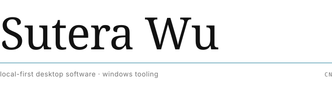

<picture>
  <source media="(prefers-color-scheme: dark)" srcset="profile/masthead-dark.svg">
  
</picture>

I build local-first software for Windows: a usage meter that reads what your coding agents actually spend, a
workbench for your own WeChat archive, and a desktop pet for DeepSeek Harness. Everything runs on your machine —
no accounts, no telemetry, nothing phoning home.

---

**metera** — usage meter for AI coding agents &nbsp;·&nbsp; Rust, Tauri
 
**微语** — local WeChat archive workbench &nbsp;·&nbsp; Python, Tauri
 
**dsh-whale-musume** — desktop pet for DeepSeek Harness &nbsp;·&nbsp; JavaScript, 142 tests
 
**dsh-statusbar** — status line for the harness: tokens, cost, cache, balance &nbsp;·&nbsp; PowerShell

 

dsh-windows-notify &nbsp;·&nbsp; dsh-sandbox-tester &nbsp;·&nbsp; dsh-meme-hub

 

12 pull requests merged upstream &nbsp;·&nbsp; listed by [dshbase](https://dshbase.com/zh/plugins/dsh-whale-musume/) and [deepseekplugin.org](https://deepseekplugin.org/plugins/sutera-diffusus-dsh-whale-musume) &nbsp;·&nbsp; [discussions](https://github.com/Sutera-Diffusus/dsh-whale-musume/discussions)
